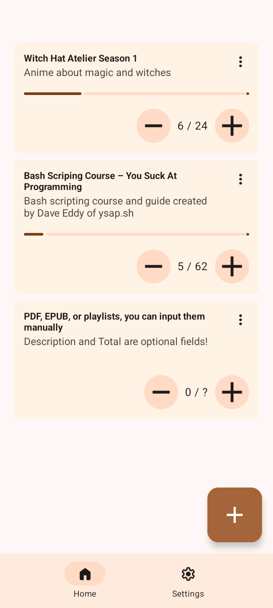
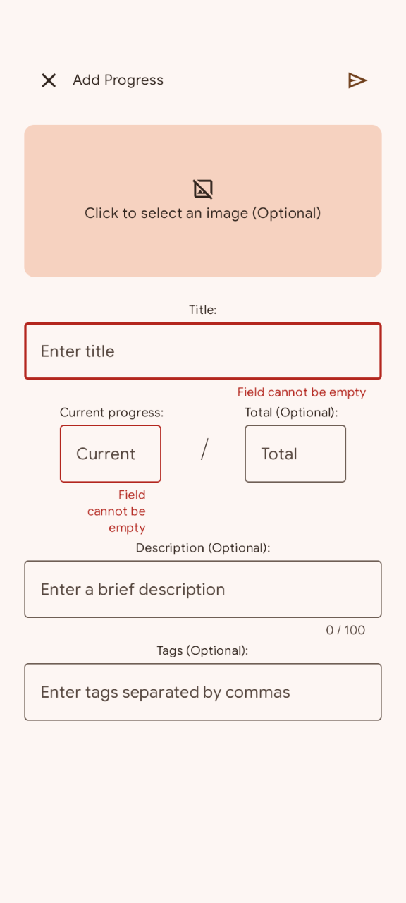
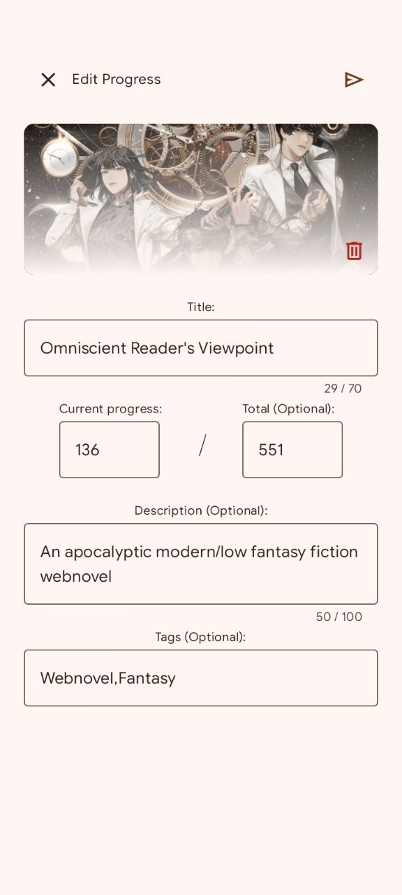
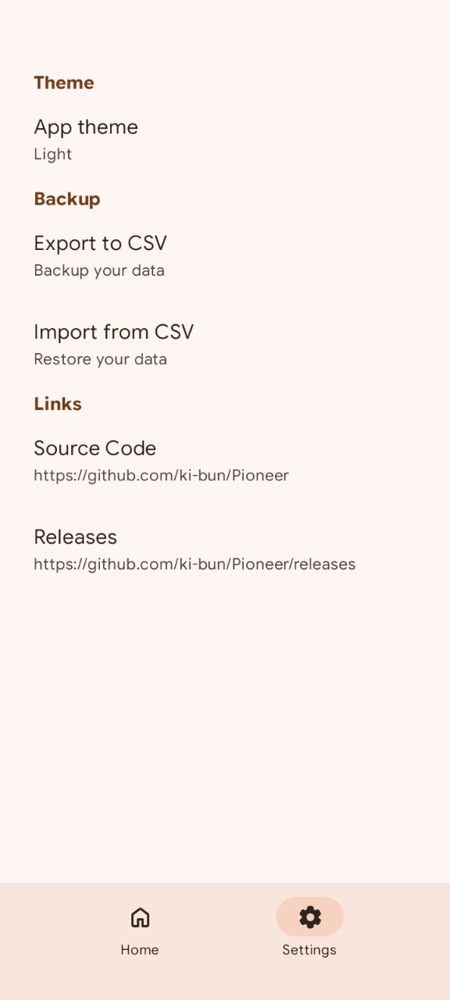

	

<h1 align="center">Pioneer</h1>

<b>Pioneer</b> is a free and open source tool to keep track of progress in an efficient way. Whether you are reading a book, .pdf, .epub, watching playlists, anime episodes, manga chapters, or anything else, Pioneer will act as one inventory to manage them, without relying on different online services.

## Features
- 🎨 Material 3 dynamic theme
- 🏷️ Display tags and images (selected from local storage)
- ❔ Optional description and maximum value
- ✍️ Option to edit and delete progress
- 💾 Import and export to CSV
- ✈️ 100% offline, no internet connection required
- 👤 No sign up or account needed
- 🔓 Open source and licensed with GPLv3
