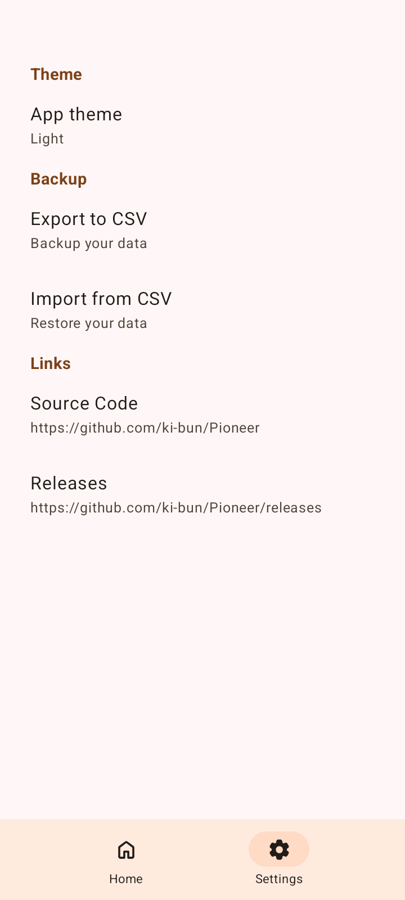
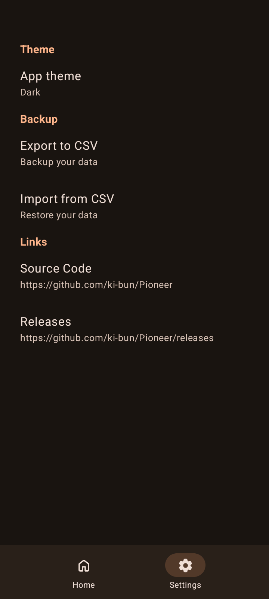

	

<h1 align="center">Pioneer</h1>
<b>Pioneer</b> is an open source tool to keep track of progress in an efficient way than using a notepad. Whether you are reading a book, .PDF, .EPUB, watching playlists, anime episodes, manga chapters, or anything else with a progress, Pioneer will act as an inventory to manage them to avoid forgetting what you have started.

# ⬇️ Installation 

# ✨ Features

- **Design**
	- Material 3 dynamic theme
	- Vertical card-based view
- **Functionality**
	- Support for optional maximum value if you are uncertain about its total
	- Option to edit and delete progress
 	- Optional description
	- Input error handling 
	- Import and export to CSV
	- Option to change app theme
- **Privacy**
	- 100% offline, no internet connection required
	- No sign up or account needed
 	- Open source and licensed with GPLv3
 
# 📸 Screenshots

<h2 align="center">Light theme ☀︎</h2>

	
| Home screen | Add dialog | Settings screen |
| --- | --- | --- |
|  |  | 

<h2 align="center">Dark theme ⏾</h2>

| Home screen | Add dialog | Settings screen |
| --- | --- | --- |
|  |  | 

**Note**: The colors vary depending on device's system colors for Android 12 and newer.
